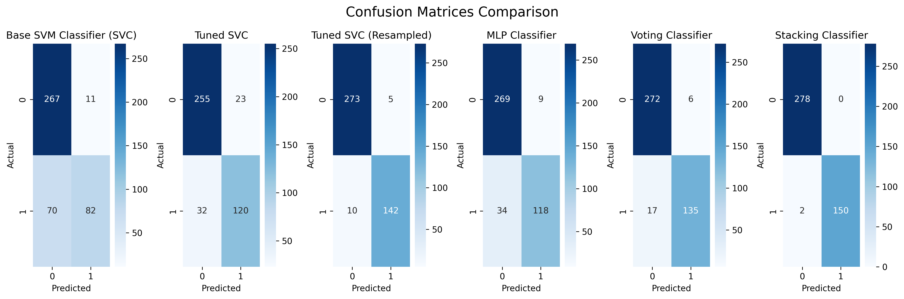

# Alzheimer's Disease Prediction: Machine Learning Approach

[](https://www.python.org/downloads/release/python-3100/)
[](https://colab.research.google.com/github/cu-mscso/alzheimers-disease-prediction)
[](LICENSE)

## Table of Contents
- [Overview](#overview)
- [Quick Start](#quick-start)
- [Installation](#installation)
  - [Prerequisites](#prerequisites)
  - [Setup Instructions](#setup-instructions)
- [Project Structure](#project-structure)
- [Dataset](#dataset)
- [Model Performance](#model-performance)
  - [Results](#results)
  - [Visualizations](#visualizations)
- [Impact & Future Work](#impact--future-work)
- [How to Cite](#how-to-cite)
- [License](#license)
- [Contact](#contact)
- [Video Resources](#video-resources)
- [Acknowledgments](#acknowledgments)

## Overview

A machine learning project for early detection of Alzheimer's disease using supervised learning techniques. This project demonstrates the application of various ML models to predict Alzheimer's disease risk based on demographic, health, and lifestyle factors.

### Key Features
- Multiple model implementations (SVM, MLP, Ensemble methods)
- Comprehensive data preprocessing pipeline
- Detailed performance analysis and visualizations
- Jupyter notebook with complete analysis

## Quick Start

1. Clone the repository:
   ```bash
   git clone https://github.com/cu-mscso/alzheimers-disease-prediction.git
   cd alzheimers-disease-prediction
   ```

2. [Set up the environment](#installation) (install dependencies and activate the virtual environment).

3. Launch Jupyter Lab:
   ```bash
   jupyter lab
   ```

## Installation

### Prerequisites
- Python 3.10+
- Git
- pip (Python package manager)
- [pyenv](https://github.com/pyenv/pyenv) (recommended for managing Python versions)

### Setup Instructions

#### 1. Install pyenv and dependencies

**macOS:**
```bash
brew update
brew install openssl readline sqlite3 xz zlib pyenv
```

**Ubuntu/Linux:**
```bash
curl https://pyenv.run | bash
sudo apt-get install -y make build-essential libssl-dev zlib1g-dev \
  libbz2-dev libreadline-dev libsqlite3-dev wget curl llvm \
  libncursesw5-dev xz-utils tk-dev libxml2-dev libxmlsec1-dev libffi-dev liblzma-dev
```
After installation, add the following to your `~/.zshrc` or `~/.bashrc`:
```bash
export PATH="$HOME/.pyenv/bin:$PATH"
eval "$(pyenv init --path)"
eval "$(pyenv virtualenv-init -)"
```
Then restart your terminal or run:
```bash
source ~/.zshrc  # or source ~/.bashrc
```

#### 2. Install Python and create a virtual environment

```bash
pyenv install 3.10.13
pyenv virtualenv 3.10.13 $(basename $PWD)
pyenv activate $(basename $PWD)
```

#### 3. Install Python dependencies

```bash
pip install -r requirements.txt
```

#### 4. Launch Jupyter Lab

```bash
jupyter lab
```

## Project Structure

```
├── notebooks/              # Jupyter notebooks
│   └── alzheimers-disease-prediction.ipynb
├── results/                # Output files
│   └── figures/            # Generated visualizations
├── requirements.txt        # Python dependencies
└── README.md               # Project documentation
```

## Dataset

This project utilizes a synthetic Alzheimer's disease dataset containing 2,149 records with 35 features.

### Kaggle Authentication Setup

To download the dataset from Kaggle, you'll need to set up your Kaggle credentials:

1. Create a Kaggle account at [https://www.kaggle.com](https://www.kaggle.com)
2. Go to your account settings and create an API token
3. Download the `kaggle.json` file
4. Place the `kaggle.json` file in your project directory or in your home directory at `~/.kaggle/`

Alternatively, you can use the following commands to set up your Kaggle credentials:

```bash
# Create .kaggle directory if it doesn't exist
mkdir -p ~/.kaggle

# Set up your Kaggle credentials
kaggle config set -n username -v YOUR_USERNAME
kaggle config set -n key -v YOUR_API_KEY
```

### Features
- **Demographic**: Age, gender, ethnicity
- **Health Metrics**: BMI, blood pressure, cholesterol
- **Lifestyle**: Smoking status, alcohol consumption, physical activity
- **Medical History**: Family history, cardiovascular disease, diabetes
- **Cognitive**: MMSE scores, memory complaints

### Sample Data
| Age | Gender | MMSE_Score | Systolic_BP | Diagnosis |
|-----|--------|------------|-------------|-----------|
| 72  | F      | 28         | 128         | 0         |
| 68  | M      | 24         | 135         | 1         |
| 75  | F      | 22         | 142         | 1         |

*Table 1: Sample data from the Alzheimer's disease dataset*

## Model Performance

### Results

| Model                | Accuracy | Precision (0/1) | Recall (0/1) | F1-Score (0/1) | ROC-AUC |
|----------------------|----------|-----------------|--------------|----------------|---------|
| Base SVM (SVC)       | 0.81     | 0.79 / 0.88     | 0.96 / 0.54  | 0.87 / 0.67    | 0.92    |
| Tuned SVC            | 0.87     | 0.89 / 0.84     | 0.92 / 0.79  | 0.90 / 0.81    | 0.93    |
| Tuned SVC (Resampled)| 0.65     | 0.65 / 1.00     | 1.00 / 0.00  | 0.79 / 0.00    | -       |
| MLP Classifier       | 0.35     | 1.00 / 0.35     | 0.00 / 1.00  | 0.00 / 0.52    | -       |
| Voting Classifier    | 0.94     | 0.96 / 0.92     | 0.95 / 0.93  | 0.96 / 0.92    | 0.96    |
| Stacking Classifier  | 0.95     | 0.96 / 0.95     | 0.97 / 0.92  | 0.96 / 0.93    | 0.96    |

*Table 2: Performance comparison of machine learning models (Class 0: No Alzheimer's, Class 1: Alzheimer's)*

### Key Observations
- The **Stacking Classifier** achieved the highest accuracy (95%) and balanced performance across both classes.
- **Ensemble methods** (Voting and Stacking) consistently outperformed individual models.
- The MLP Classifier showed poor performance (35% accuracy) with complete failure to predict Class 0.
- Class imbalance is evident, particularly in the resampled SVC model which predicted all samples as Class 0.

### Visualizations

#### ROC Curves

*Figure 1: ROC curves showing model performance (higher AUC = better performance)*

#### Confusion Matrices

*Figure 2: Confusion matrices for model evaluation*

#### Feature Correlation

*Figure 3: Correlation between dataset features*

## Impact & Future Work

- **Best Model:** Stacking Classifier achieved 95% accuracy (0.96 ROC-AUC); ensemble methods outperformed single models.
- **Key Insights:** MMSE scores, age, and biomarkers are top predictors; class imbalance remains a challenge.
- **Next Steps:** Expand dataset (e.g., neuroimaging), test advanced models (transformers), address class imbalance, validate clinically, and explore EHR integration.

## How to Cite

```bibtex
@misc{mohammed2025alzheimer,
  author = {Mohammed, Abdul},
  title = {Machine Learning for Alzheimer's Disease Prediction},
  year = {2025},
  publisher = {GitHub},
  journal = {GitHub repository},
  howpublished = {\url{https://github.com/cu-mscso/alzheimers-disease-prediction}}
}
```

## License

This project is licensed under the MIT License - see the [LICENSE](LICENSE) file for details.

## Contact

For questions or feedback, please reach out to [Abdul Mohammed](https://github.com/am368a) or open an issue on GitHub.

## Video Resources

This project was inspired by and makes use of insights from the following video resources:

- [Step-by-Step Data Cleaning with Python](https://www.youtube.com/watch?v=MDaMmWBI-S8)
- [Hands-on Class Imbalance Treatment in Python](https://www.youtube.com/watch?v=HJ0Av9xkPA8)

## Acknowledgments

- [Kaggle](https://www.kaggle.com/) for the dataset.
- [scikit-learn](https://scikit-learn.org/) for machine learning tools.
- [matplotlib](https://matplotlib.org/) and [seaborn](https://seaborn.pydata.org/) for visualizations.